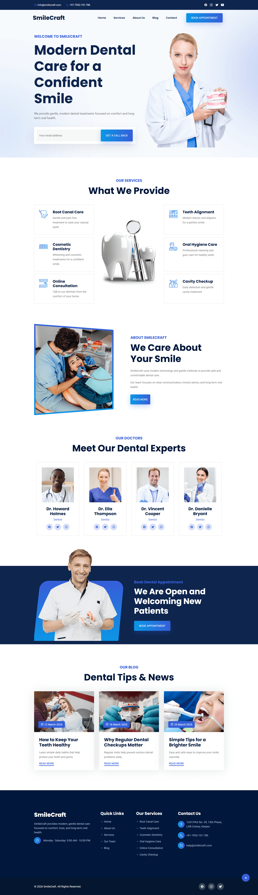

  <h1>Smile Craft</h1>

  

    <strong>About the Project:</strong>
    SmileCraft is a dental clinic website built with HTML, CSS, and JavaScript. It presents services, team profiles, and clinic information in a clean, professional layout — structured to show real-world frontend skills.
  

  

    <strong>Key Highlights:</strong>
    Component-based JavaScript architecture, smooth scroll interactions, sticky header, horizontal doctor card slider, and a fully responsive layout across all screen sizes.
  

  
<h2>Project Details</h2>

  

    
<h4>What's Inside</h4>

    <ul>
      <li><strong>Header</strong> — Top bar with contact info, navigation, and sticky scroll behavior.</li>
      <li><strong>Hero</strong> — Full-width banner with headline, description, and email callback form.</li>
      <li><strong>Services</strong> — Six dental service cards displayed in a responsive grid layout.</li>
      <li><strong>About</strong> — Clinic overview section with image and descriptive content.</li>
      <li><strong>Doctors</strong> — Horizontally scrollable cards showing team members and roles.</li>
      <li><strong>CTA</strong> — Appointment booking section with banner image and call-to-action button.</li>
      <li><strong>Blog</strong> — Three blog cards with date badges and read more links.</li>
      <li><strong>Footer</strong> — Multi-column layout with links, services, and contact details.</li>
      <li><strong>Back to Top</strong> — Floating button that appears after scrolling down the page.</li>
    </ul>
  

  

    
<h4>Key Features</h4>

    <ul>
      <li><strong>Component-Based Structure</strong> — Each section is a separate, independently rendered JavaScript module.</li>
      <li><strong>Sticky Header</strong> — Header slides in with animation when user scrolls down the page.</li>
      <li><strong>Mobile Navigation</strong> — Toggle menu opens and closes smoothly on smaller screens.</li>
      <li><strong>Horizontal Doctor Slider</strong> — Scrollable card list with custom scrollbar styling per breakpoint.</li>
      <li><strong>Email Callback Form</strong> — Hero form captures email and confirms submission with a message.</li>
      <li><strong>Back to Top Button</strong> — Appears after 300px scroll with smooth visibility transition.</li>
      <li><strong>Responsive Design</strong> — Layout adapts cleanly across mobile, tablet, and desktop screens.</li>
    </ul>
  

  

    
<h4>Technologies Used</h4>

    <ul>
      <li><strong>HTML5</strong> — Semantic structure with accessible landmarks and ARIA labels.</li>
      <li><strong>CSS3</strong> — Custom properties, CSS Grid, Flexbox, animations, and media queries.</li>
      <li><strong>JavaScript (ES6+)</strong> — Modular components using ES module imports and exports.</li>
      <li><strong>Ionicons</strong> — Icon library used for UI icons throughout the site.</li>
      <li><strong>Google Fonts</strong> — Poppins and Roboto loaded for consistent typography.</li>
    </ul>
  

  

    
<h4>Project Structure</h4>

    <pre>
smile-craft/
│
├── index.html                 # Main HTML with section root elements
│
├── assets/
│   ├── css/
│   │   └── style.css         # Complete styles with custom properties and responsive design
│   │
│   ├── js/
│   │   ├── app.js            # Main entry point that imports and initializes all components
│   │   ├── header.js         # Header component with navigation and sticky behavior
│   │   ├── hero.js           # Hero banner with email form functionality
│   │   ├── service.js        # Services grid with cards and banner
│   │   ├── about.js          # About section component
│   │   ├── doctor.js         # Doctor profiles with horizontal scroll
│   │   ├── cta.js            # Call-to-action section component
│   │   ├── blog.js           # Blog cards grid component
│   │   ├── footer.js         # Footer with multiple columns
│   │   └── backTop.js        # Back-to-top button with scroll detection
│   │
│   └── images/               # Hero banners, service icons, doctor photos, blog images
│
└── README.md                 # Project documentation
    </pre>
  

  

    
<h4>Quick Start</h4>

    <ol>
      <li>
        <strong>Clone the repository:</strong>
        <pre><code>git clone https://github.com/nawazdevx/smile-craft.git</code></pre>
      </li>

      <li>
        <strong>Open the project:</strong>
        <ul>
          <li>Open <code>index.html</code> directly in your browser</li>
          <li>Or run a local server:</li>
        </ul>
        <pre><code>python -m http.server 3000</code></pre>
        Then visit <code>http://localhost:3000</code>
      </li>

      <li>
        <strong>Start Customizing:</strong>
        <ul>
          <li>Update clinic name, contact, and menu links in <code>header.js</code></li>
          <li>Edit headline, description, and hero image in <code>hero.js</code></li>
          <li>Add or update dental service cards in <code>service.js</code></li>
          <li>Change doctor names, roles, and photos in <code>doctor.js</code></li>
          <li>Update colors, fonts, and spacing variables in <code>style.css</code></li>
        </ul>
      </li>
    </ol>

  

  <strong>License:</strong>
  This project is licensed under the <a href="https://choosealicense.com/licenses/mit/">MIT License</a>.

  <strong>Contact:</strong>
  Connect with me on <a href="https://www.linkedin.com/in/nawazdevx">LinkedIn</a> or visit my <a href="https://nawazdevx.vercel.app/">Portfolio</a>.

  <strong>Support:</strong>
  Found this helpful? Give it a ⭐ on GitHub! Thank you.

 

  <h2>Project Preview</h2>

  

    <strong>Live project ➜</strong>
    <a href="https://nawazdevx.github.io/smile-craft/" target="_blank">
      <strong>Live Demo</strong>
    </a>
  

  

